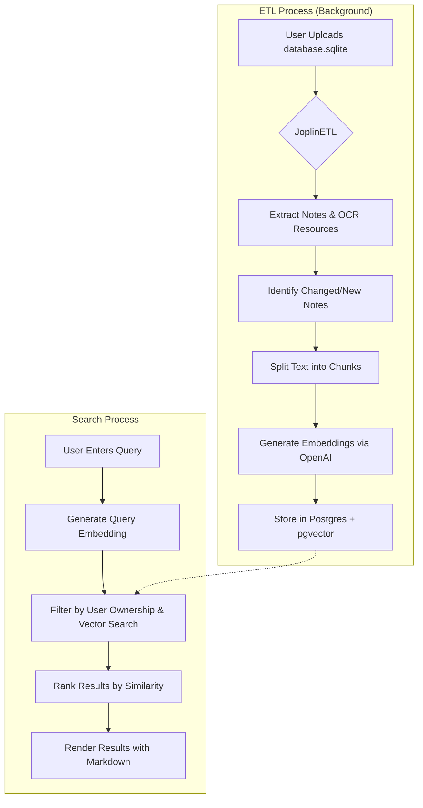

# Joplin RAG Search

A Django-based web application that enables semantic search over your Joplin notes using Retrieval-Augmented Generation (RAG).

## Features

-   **SQLite Upload**: Securely upload your Joplin `database.sqlite` file.
-   **Semantic Search**: Search your notes using natural language queries, powered by OpenAI embeddings.
-   **OCR Integration**: Automatically indexes and displays text extracted from images in your notes.
-   **Upload Feedback**: See the number of new and updated notes after each upload, along with completion status and timestamps.
-   **Local Timezone Detection**: Dates and times are automatically displayed in your native timezone using `django-tz-detect`.
-   **Markdown Rendering**: Search results are rendered with full Markdown support (tables, code blocks, etc.).
-   **Deep Linking**: Search results include deep links (`joplin://`) to open notes directly in your local Joplin desktop application.
-   **Efficient Processing**: Uses an ETL pipeline to process uploads in the background via Celery and only re-indexes modified notes.

## Architecture

This project uses a modern Python stack:

-   **Backend**: Django 5.0
-   **Database**: PostgreSQL with `pgvector` extension (for vector similarity search).
-   **Task Queue**: Celery with Redis (for asynchronous background processing).
-   **Dependency Management**: `uv` and `pyproject.toml`.
-   **AI/ML**: OpenAI `text-embedding-ada-002` for generating embeddings.

## System Workflow



## Project Structure

```bash
.
├── src/                # All Django source code
│   ├── joplin_rag/     # Project configuration (settings, urls, celery)
│   ├── notes/          # Main application (models, views, ETL, search)
│   ├── templates/      # HTML templates
│   └── static/         # Static assets (CSS, images)
├── docker-compose.yml  # Container orchestration
├── Dockerfile          # Container definition
├── pyproject.toml      # Dependency definitions (uv)
└── README.md
```

## Development Setup

### Prerequisites

-   Docker & Docker Compose
-   OpenAI API Key

### Configuration

1.  **Environment Variables**:
    Copy the template and fill in your values.
    ```bash
    cp .env.template .env
    ```
    Ensure you set `OPENAI_API_KEY`.

2.  **Start the Application**:
    ```bash
    docker-compose up --build
    ```

3.  **Run Migrations**:
    ```bash
    docker-compose exec web uv run python src/manage.py migrate
    ```

4.  **Create Admin User**:
    ```bash
    docker-compose exec web uv run python src/manage.py createsuperuser
    ```

## Usage

1.  **Upload**: Go to the "Upload" tab and select your `database.sqlite`.
2.  **Monitor**: View the upload status and note counts directly on the upload page.
3.  **Search**: Use the "Search" tab to query your library. Results include OCR text and rendered Markdown.
